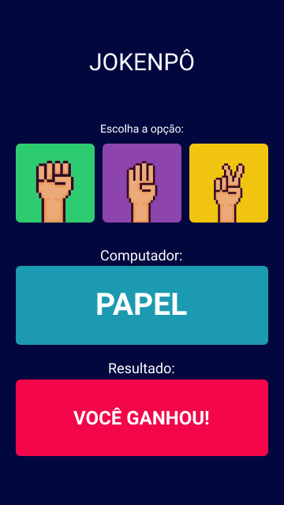

<br/>
<div align="center">
  <sub>Created by <a href="https://www.guilhermeluis.com">Guilherme Luis Faustino</a></sub>
</div>


## What is inside?

This project uses lot of stuff as:

- [TypeScript](https://www.typescriptlang.org/)
- [Ionic](https://ionicframework.com/)

## Getting Started

First, run the development server:

```bash
npm start
# or
yarn start
```

Open [http://localhost:8100](http://localhost:8100) with your browser to see the result.


## Deploy on Vercel

The easiest way to deploy your app is to use the [Vercel Platform](https://vercel.com/import?utm_medium=default-template&filter=next.js&utm_source=create-next-app&utm_campaign=create-next-app-readme) from the creators of Next.js.

Check out our [Next.js deployment documentation](https://nextjs.org/docs/deployment) for more details.
